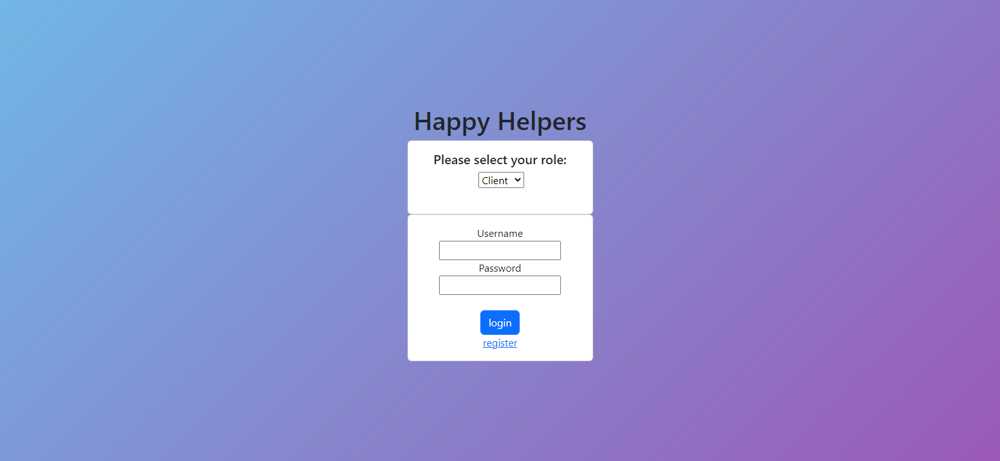

# Happy-Helper

This repo will contain code for our Happy Helper App

## Description:
The primary purpose of Happy Helper is to provide assistance with everyday tasks to newly discharged hospital patients based on their needs. The current model allows the user to request a task to be performed by a volunteer helper. After the request has been made, the helper can accept the task based on day, time, location, and type of task to be performed. 

## Table of Contents

- [History and Motivation](#history-and-motivation)
- [Installation](#installation)
- [Usage](#usage)
- [License](#license)
- [How to contribute](#how-to-contribute)
- [Tests](#tests)
- [Questions](#questions)

## HISTORY AND MOTIVATION:
Our group member, Sean Bristol-Lee, has a history in the medical field, specifically Physical Therapy. 
In his experience, Sean noticed many patients would be discharged from the Hospital and then go home to busy family members or sometimes alone. So many patients needed help with simple everyday tasks such as:

1. Walking the dog
2. Basic housekeeping
3. Picking up groceries
4. Basic errands
5. And many others

Sean posed the idea to Osama, Naser, and Hawa and they agreed to pursue the idea of creating an app that would provide much solace and relief to newly discharged patients. There are also many people out there that have skill sets and free time that would love to give back in some way. The volunteer aspect of this app allows room for users to give and receive the help they need without money being a hindering or motivating factor. 

## Table of Contents

- [History and Motivation](#history-and-motivation)
- [Installation](#installation)
- [Usage](#usage)
- [License](#license)
- [How to contribute](#how-to-contribute)
- [Tests](#tests)
- [Questions](#questions)

## Installation
A link to the Happy Helpers application can found here:
https://happy-helpers-app.herokuapp.com/

No further installation is required to test out the application. 
The repository containing the working code to the application can be found here:
https://github.com/HawaFallay/Happy-Helper-

To run this application from VS Code, clone a copy of the repository from GitHub. Install inquirer by typing "npm install inqurier@8.2.4". In the terminal, navigate to the directory where the server.js file is located. In the terminal, type "node server.js".

## Usage
The user can register as either a client or helper. Once all the fields of the registration page has been completed, the user will be redicred to the login page. Fill in the correct information, and the user will be take to either the client dashboard page or the helpers dashboard page depending on the role the user selected. As a client the user will be able to submit tasks by filling out the requested fields and pressing the submit task button. The client will be able to view all of their submitted task by clicking on the "View Task" button. The client will be able to see all task that are still open for helpers to accept as well as tasks that have already by accepted by helpers. If a user registers as a helper, the user will be able to view all available tasks from their dashboard. The helper can then accept any tasks they wish to help clients with. The helper can also view all of the tasks they've accepted as well as task that have been completed.  

## License
MIT License

A short and simple permissive license with conditions only requiring preservation of copyright and license notices. Licensed works, modifications, and larger works may be distributed under different terms and without source code. Refer to link for more details: https://choosealicense.com/licenses/mit/

## How to Contribute
Feel free to contribute to our project on GitHub. A link to the repository is above and a link to the GitHub page is provided in the Questions section.

## Tests
N/A  

## Questions
Feel free to view and contribute to our on GitHub pages.
https://github.com/naser421

https://github.com/oriarh

https://github.com/SeanBL

https://github.com/HawaFallay

For additional questions, can also reach us through our email address here:

Naser Suleiman
naser.4211997@gmail.com

Osama Pervez Riarh
osamapervezriar@gmail.com

Sean Bristol-Lee
seanbristol81@gmail.com

Hawa Falla
hawafallay@gmail.com